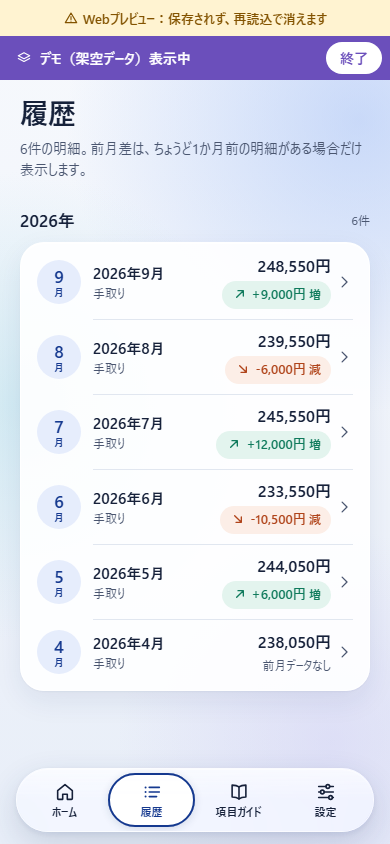
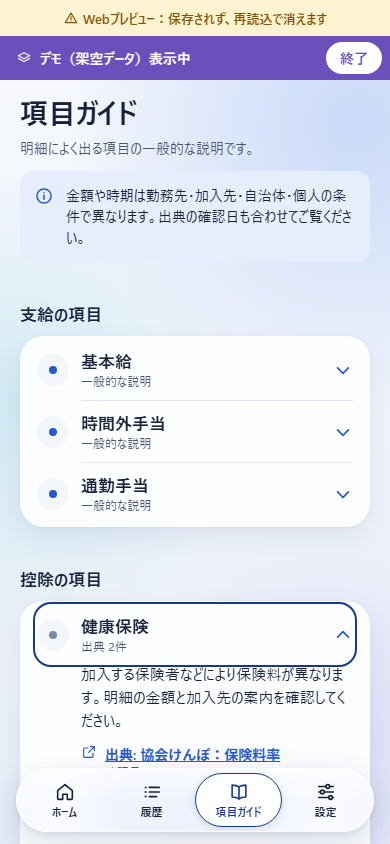
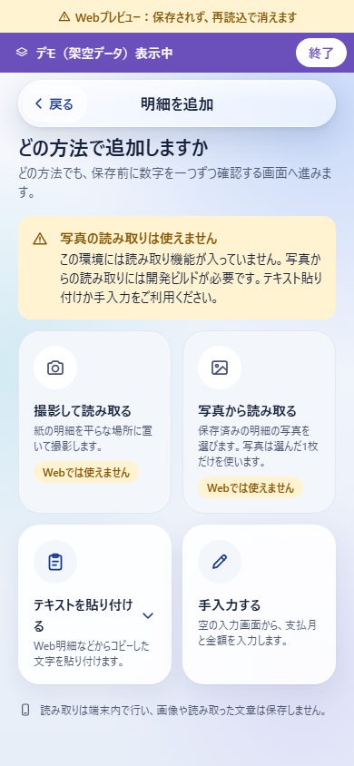
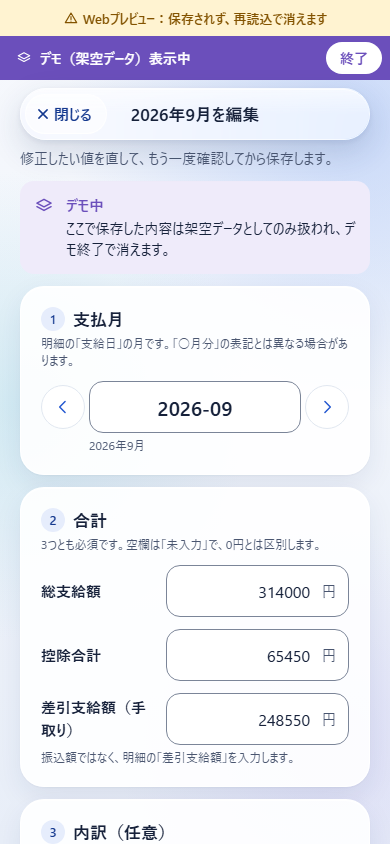
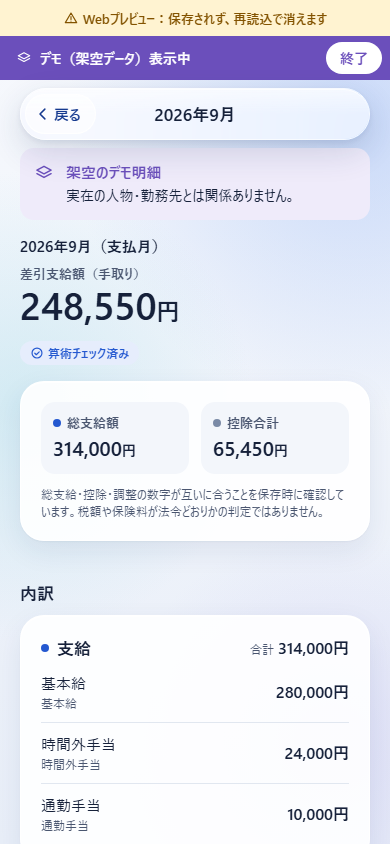
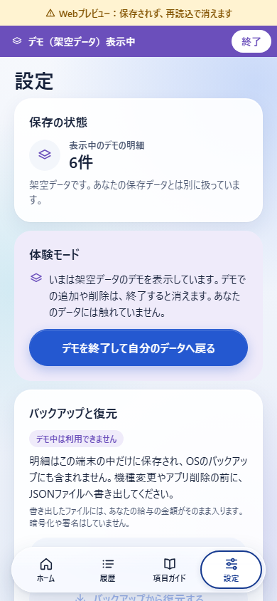
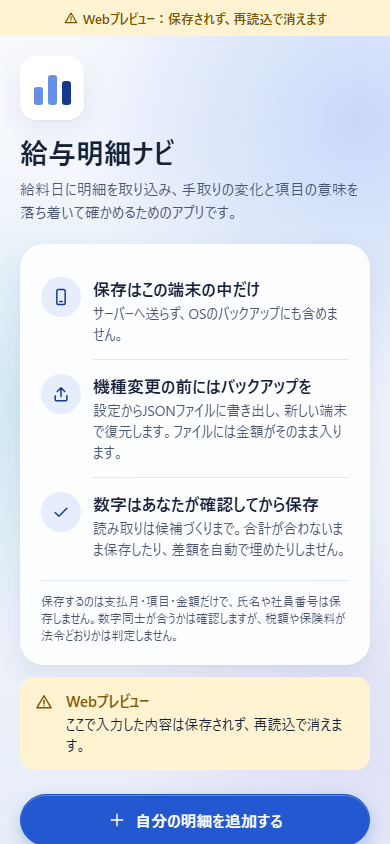
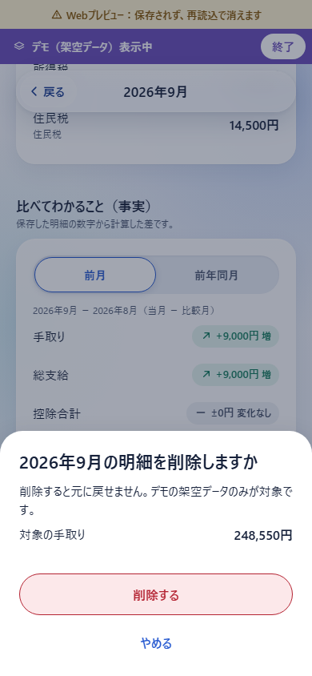

# UI画面

2026-09-29。Liquid Glassを参考に、給与明細の金額と操作を中心に再設計した独自UI。最終UIコードは `7092675`。以下はすべて架空データ・390px幅のWebプレビューで、実機画面や参考サイトの画像ではありません。既存の4タブ＋スタック構成と、確認してから保存する手順を維持しています。

## ホームの変更前後

| 変更前 | Glass UI |
| --- | --- |
|  |  |

## 各画面

| 履歴 | 項目ガイド |
| --- | --- |
|  |  |

| 追加方法 | 確認・編集 |
| --- | --- |
|  |  |

| 明細の詳細 | 設定 |
| --- | --- |
|  |  |

| 初回案内 | 確認ダイアログ |
| --- | --- |
|  |  |

透明度・動きの低減、強制カラー、320/390/430/1280幅の検証範囲は [検証記録](VERIFICATION.md) に記載しています。金額を丸める表示やカウントアップは行わず、未入力と0円、欠月、負値を区別します。
