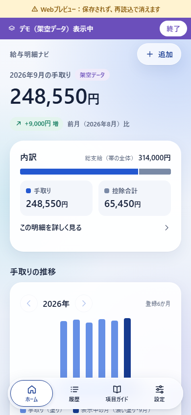

# UI Glass 進捗（G1＋G2＋ホーム）

2026-09-29。設計は `docs/UI-GLASS-DESIGN.md`（レビュー08のD-M1〜D-M4、管理側の観点、Solのコントラスト再計算を反映）。この段階の対象はG1の基盤、G2の機能層、ホームの統合。ほかの画面のレイアウト改善（G3）は次の段階で行う。

**現在の状態:** G-C1の極小区画は修正され、公開Chromium30件とWebKit8件が合格。G3の7画面を実装し、型/lint・145単体と新G3の公開Chromium30件も成功。全画面の独立撮影・契約点検・最終reviewを進行中。保存件数の表現についてG3-C1の指摘があり、解消後にmainへ統合する。

## G2保存時の独立QA（後続のG-C1対応・G3検証を参照）

- 型/lint・145単体テストが成功。Webの新しいexportで公開Chromium E2E29件が成功し、撮影専用1件はskip。WebKitの390px比較6件も成功した。
- 安定した描画後に13枚を撮影し、ページ/コンソールエラーは0。WebのARIA状態、強制色light/darkの棒・アイコン・フォーカス、通常色、透明度の代替表示を確認した。
- 非UIの契約点検ではdomain/services/native OCR/設定プラグイン/useAppData/chartScaleは`1cfdf62`から不変。保存・置換・破棄・デモ・復元・比較の意味に回帰は見つからなかった。
- **未解消 G-C1（割合帯）:** 区画のborderが極小区画へ固定幅を与える。総支給10億円・手取り999,999,999円・控除1円を通常操作で保存すると、390px画面で控除区画の比例期待幅は約0.000000306px、実幅は2px。320pxでも2pxだった。金額ラベルと保存値は正しく、視覚的な割合だけが影響する。
- G-C1を公開`e2e/glass.spec.ts`へ追加し、320/390の両幅で失敗することを確認した。許容差はCSSの丸めに対する1/64pxだけ。skip/fixmeで除外していない。前述の29件成功はこの新しい検査を追加する前の結果であり、全体合格を意味しない。
- 次は、幅を消費する縁を除くか、配置幅を変えない装飾へ移し、この回帰を通してからG3へ進む。修正・G3統合後に独立レビューと全体CIを通す。

## Webの途中画面

すべて架空データ。元の参考画像は含めていない。nativeの素材表示は実機未確認。

| 改修前 | Glass基盤・ホーム |
| --- | --- |
|  |  |

[強制カラーdarkの表示](../screenshots/fictional/home-forced-colors.png)も確認した。これはアプリに通常のダークテーマを追加したものではない。

## 変更

- **G1 基盤（`src/ui/glass/`）**
  - `palette.ts`: 色の正本（RNに依存しない）。`theme.ts` の `colors` はこれを再輸出する。inkMuted は `#4A5670`、inkSubtle は `#56627A` に変更。Scene・ガラス・カプセル・glassボタン・戻るピル・controlTrack の色を追加し、`stageGlow`・`navInk`・`navInactive`・`onPrimaryMuted` を削除した。
  - `glassMode.ts`: `prefsReducer` は event→query の時に query を捨て、fail は安全側（on）、unsupported は off と区別する。`resolveGlass` は unknown・透明度低減・高コントラスト（increaseContrast または forcedColors）・Android の target 未準備のどれかなら solid にする。
  - `contrast.ts`: WCAG の相対輝度とアルファ合成を丸めずに計算する。
  - `platform.{ios,android,web}.tsx` と既定の `platform.tsx`:
    - iOS: expo-glass-effect と expo-blur を遅延 require＋try/catch で読み込む。2つの guard が通れば native、読めれば blur、読めなければ none。設定は ReduceTransparency と DarkerSystemColors。`USE_NATIVE_GLASS` と `NATIVE_TINT` は D-M4(b) の切替点。
    - Android: API 31以上なら BlurView（`blurTarget`＋`dimezisBlurViewSdk31Plus`）、30以下は不透明。設定は HighTextContrast だけで、透明度と forcedColors は unsupported。
    - Web: `CSS.supports` でぼかしの対応を調べる。設定は matchMedia の reduced-transparency・contrast・forced-colors。`backdrop-filter` はクリップする層に付ける。
  - `nativePrefs.ts`: 先に listener を登録し、その後に問い合わせる。`active` フラグで cleanup 後の dispatch を止め、remove する。
  - `GlassProvider`（購読は1か所）、`BlurTarget`、`GlassSurface`（外側の層に影、内側の層でクリップ。native / blur / solid / 高コントラスト。外形は全モードで同じ）、`Scene`（固定のグラデーションと塊3つ。高コントラストでは一色）、`surfaceStyle`。
- **theme.ts:** 影を card・glass・highlight・capsule・buttonPrimary・dialog にした。半径 card24・header26・nav32 を追加。`focusRing`・`focusRingInset` は outline を主にした（forced-colors で影が消えても残る）。
- **G2 機能層**
  - `AppRoot`: `GlassProvider` を置き、層の順を「ヘッダー（先頭、zIndex 2）→ BlurTarget（Scene・帯・本文）→ ナビ → Dialog」にした。
    - 浮遊ヘッダーの top は、region の `layout.y` をそのまま使う（safe area は column の paddingTop で1回だけ数える）。
    - 本文の上余白はヘッダーの実測高、下余白はナビの実測高＋NAV_GAP＋safe area＋24。
    - 青い上端と overscroll を廃止し、StatusBar は dark に固定した。
  - `TabBar`: GlassSurface に移した。文字は ink と primaryDeep。カプセルの縁は全モードで primaryDeep 1.5px。無効時は ink のまま、細い線と disabled の状態で示す。出現は translateY だけ（opacity は1）。高さを実測して親へ渡す。
  - `ScreenHeader`: 浮遊するガラスのバーにした。戻るピルは primaryDeep、押下は子の色で示し、不透明時は lineStrong の縁。フォーカスは inset。
- **共通部品（`components.tsx`）**
  - Card は surfaceStyle（半径24）。
  - Button は `inverse` を廃止して `glass` を追加（不透明時は白＋lineStrong）。primary に影を付けた。
  - IconButton と DeltaChip の `onStage` を削除。
  - Segmented の溝を controlTrack にした。SplitBar と凡例の見本は同じ色の縁を持つ（forced-colors 対策）。
- **ホーム:** `Stage.tsx` を削除して `Hero.tsx`（面なし、上8・下20）を置いた。
  - 文字色は ink と inkMuted。デモは Badge。追加は `glass` ボタン。
  - 内訳シートは raised の面で、重なり（-28）をやめた。
  - 空の時は、ガラス風の円と primary ボタン。
- ほかの画面は変更していない（使っている共通 props は互換のまま）。

## 検証（この環境）

- `npm.cmd test`: 9ファイル・145件がすべて合格（従来の93件＋glass の52件）。glass の52件は reducer の順序と失敗時、resolveGlass の組合せ、Sol 監査の合成色（`#BCCFF1`、`#F8FAFE`、`#FBFCFE`、`#B3B4B8`、`#DDDDDF`）、許可された組合せが基準以上であること、禁止した組合せが基準未満であること。
- `npm.cmd run lint`: 自分の担当ファイルにエラーと警告はない（Sol の作業中の `e2e/glass.spec.ts` に警告が1件）。
- `tsc --noEmit`: 自分の担当ファイルにエラーはない。Sol の作業中の `e2e/glass.spec.ts` の104行と107行に TS2352（`window` の型変換）が残っている。これは Sol の担当。
- Web export、ブラウザ、E2E、撮影は Sol が独立環境（19127）で行うので、ここでは実行していない。

## 未確認

- Web の見た目（撮影）と、既存の E2E 15件・glass.spec の合否。特に次の点。
  - 390×844・デモ帯ありの「plot＋72 ≦ nav」（ヒーローが8px低くなるので満たす見込みだが、未計測）。
  - 詳細画面で最初の Tab が戻るに届くこと。
  - forced-colors の outline。
- native はすべて未検証。項目は次のとおり。
  - iOS 26: guard、native の表示、ナビのラベルの画素コントラスト。
  - 旧 iOS: blur になること。
  - Android 31以上: BlurTarget、黒い面、target 準備直後の最初の1フレーム。30以下: solid になること。
  - safe area を二重に加算していないこと。
  - 設定の起動時 on と途中の切替。
  - dev build の再作成と、Android の prebuild・autolinking の再生成。
- RN native での `outline*` と inset `boxShadow` の描画。

## 次の段階（G3）

- 設計 §9 の表に沿って、履歴・ガイド・設定・追加方式・確認編集・詳細・初回案内（読込・失敗を含む）を Glass の体系で組み直す。機能・文言・確認の流れは維持する。
- 詳細画面の0項目の文言を、事実に合う表現に直す。
- `layout.tsx` の `navReserve` はもう使っていない。次の段階で整理する。

## 実画面QA後の限定修正（2026-09-29、HEAD `8778da8` の上）

独立Web QA（Chromium・WebKit）で見つかった実害だけを直した。データ・保存条件・確認の意味、金額と棒の geometry は変えていない。

- **Web の ARIA 状態:** RN Web 0.21 は `accessibilityState` を DOM へ出さない。`src/ui/a11y.ts` の `a11yState` で、Web だけ同じ状態を `aria-selected`・`aria-checked`・`aria-busy`・`aria-expanded` でも出す。native は従来どおり `accessibilityState` だけ（aria-* は合成されるので渡さない）。
  - 対象: TabBar のタブ、Segmented、Checkbox、Button（busy）、項目 Chip（radio。Web は `aria-checked`、native は従来の selected）、推移の数値一覧・ガイド・読み取り行・追加方式カードの開閉。
  - disabled は Pressable の `disabled` が Web でも `aria-disabled` を出すので変えていない。
- **強制色（Web の `forced-colors: active`）:**
  - 推移の棒・0円線・凡例の見本・割合帯の区画・割合帯の凡例の見本は、塗りが Canvas に置き換わって消えていた。`glass/forcedColors.web.ts` が media 内だけの規則を1つの style 要素で入れ、対象の要素だけ `forced-color-adjust: none` にしてシステム色で塗る。通常の棒・0円線・控除合計は CanvasText、表示中の月・手取りの区画は Highlight、表示中の月が負の時は Canvas の地に Highlight の破線の縁。負の棒・0円の印・未登録の「–」は、縁と文字が強制色でも残るので変えていない。
  - native・vitest・tsc が読む `forcedColors.ts` は何も付けない。形・大きさ・最小値は変えていない。ページ全体の強制色は無効にしていない。
  - SVG アイコンは stroke/fill が強制されず、暗い強制色で濃紺のまま沈んでいた。Web だけ線と塗りを `currentColor` にし、色を包む要素の `color` で渡す。強制色では文字と同じシステム色になる。native は従来どおり色を直接渡す。
- **L4（入場中の動きを減らす）:** `useEnterAnimation` は購読の状態が full 以外に変わると、再生中の入場を止めて最終状態にする。unknown で表示した内容を後から隠したり再入場させたりはしない。押下・選択・開閉の hook は変えていない。
- **Low の扱い（G3 で対応）:** L1 は「戻るを最初の Tab にするため、ヘッダーを帯より先の DOM 順にする」意図を G3 で設計に記録する。L2 の `right` スロットは当面使わない。L3 は G3 の設定画面で確認する。L5 のナビ再入場は短い反応として現状を採用する。L6 は可読性の下限と fallback を維持し、未対応判定を過剰に断定しない。

### 検証（この環境）

- `npx.cmd tsc --noEmit`: エラーなし。`npm.cmd run lint`: エラー・警告なし。`npm.cmd test`: 9ファイル・145件が合格。
- ブラウザ・E2E・撮影は、修正後に QA 担当が独立環境で行う（ここでは実行していない）。未確認: 強制色 light/dark での棒・アイコンの実描画、Web の aria-* の実DOM、native の非回帰（native の状態は変えていない）。

## G-C1 対応（2026-09-29、HEAD `1fcedbb` の上）

- `SplitBar` の区画から同じ色の `borderWidth: 1` を外した。`flexBasis: 0` の区画でも縁の2pxは配置幅に入るため、1円の区画が2px幅になっていた。区画の幅は `flexGrow`（総支給に対する比率）だけで決まる。
- 強制色では従来どおり `forcedColors.web.ts` が区画の背景を Highlight（手取り）/ CanvasText（控除合計）で塗るので、縁がなくても区画は残る。区画間の2pxの gap・0円区画を描かない条件・負値等の fallback・凡例の見本・金額・読み上げは変えていない。上の「SplitBar と凡例の見本は同じ色の縁を持つ」は、割合帯の区画については撤回（凡例の見本は変更なし）。
- `npm.cmd run typecheck`・`npm.cmd run lint`: エラー・警告なし。`npm.cmd test`: 9ファイル・145件が合格。公開 E2E（320/390 の回帰を含む）と強制色の実描画は QA 担当が独立確認する（ここでは未実行）。

## G3 対応（2026-09-29、HEAD `1fcedbb`＋G-C1 修正の上）

設計 §9 の表に沿って、7画面の配置・余白・階層を Glass の体系で組み直した。domain・services・native OCR・`useAppData`・`chartScale`・AppRoot のルーター/4タブ＋stack・依存・テストは変更していない。E2E が参照する操作名・入力名・表示文は維持した。

- **履歴:** 件数と前月差の説明の下に、年ごとの見出し行（年＋件数）と1枚のカード。行は最小高64で、月バッジ／支払月／手取り（右寄せ）／前月差のチップか「前月データなし」。差は `comparePayslips` の暦上の前月だけ（欠月を直前の登録月で代えない）。行の読み上げは「支払月、手取り、前月比」。
- **項目ガイド:** 短い説明と注意の info バナー（従来の文言を2つに分けただけ）。支給・控除・その他の区分カードに、色点・見出し・出典の件数・山形の開閉行を並べる。開くと本文と出典（確認日つきリンク）、出典が無い項目は従来の文言。`aria-expanded` を維持。
- **設定:** お知らせ（従来どおり）→ 保存の状態（件数と保存先の事実。Web は「保存されません」を warning 色、デモは架空データと表示。書き出しの完了は扱わない）→ 体験モード → バックアップと復元（アイコン付き secondary を縦に。デモ中は Badge）→ データの削除 → このアプリについて（check 行＋区切り）。書き出し・復元・全削除・再読込の処理、置換/全削除の確認、デモの分離、曖昧な失敗の文言、busy 中の無効化は変えていない。復元ボタンの読み上げ名は読み込み中も「バックアップから復元する」のまま。
- **追加方式:** 見出し「どの方法で追加しますか」。操作カードを撮影→写真→貼付→手入力の順に、幅360以上は2×2、未満は1列（横並び）。アイコン地は円48、読み取り中は「読み取り中…」とインジケーター。読み取り機能が無い環境では撮影・写真を影のない沈んだ地の無効カードにし、Badge で「Webでは使えません」（native は「開発ビルドで利用可」）と示す（文字の濃さは下げない）。貼付カードは開閉の山形・`aria-expanded`・primary 2px の縁で、開くとグリッドの下に入力カード。保存しない旨の文は最下部の caption へ移した。
- **確認・編集:** 番号付きの手順カード①支払月 ②合計 ③内訳（任意）④算術チェック ⑤確認して保存。
  - 月は前後の IconButton と中央寄せの大きめの入力。合計3欄は幅360以上でラベル左・入力右（右寄せ・「円」）、未満は縦積み。項目の金額も右寄せ。
  - 保存を試した後だけ、該当する手順の見出しに「要確認」。④の判定（「一致しています」／「確認が必要です」）は見出し行の Badge に1回だけ。
  - 保存・やめるは⑤のカードの末尾（固定フッターにしない）。項目の削除は実寸44。内訳の追加ボタンは「支給の項目を追加」などにし、④の「調整項目を追加」と同じ名前にしない。
  - 2列/縦積みは画面の幅だけで決まり、要素の並びも同じなので、入力中にフォーカスは移らない。保存・同月置換・訂正・離脱・本人チェックの処理は変えていない。
- **詳細:** デモのバナー（先頭のまま）→ Scene の上に支払月・「差引支給額（手取り）」・手取り（38を上限に段階縮小）・「算術チェック済み」→ 総支給額/控除合計のタイルと算術チェックの説明のカード → 区分ごとのカード（色点＋見出し＋支給/控除は合計）→ 比較と理由（従来どおり）→ 編集（pencil）・削除（trash）。
  - **0項目の文言を修正:** 項目0件で区分の合計が0なら「項目なし」、合計が0以外なら「項目の内訳は登録されていません（合計のみ保存）」。調整の項目が無い時は従来どおり区分を出さない。
- **初回案内・読込・失敗:** 初回案内は Scene の上に3本の棒のロゴ（半透明の白。不透明/高コントラストでは白＋lineStrong）・largeTitle・紹介文、約束3つをアイコン行のカードに、保存する範囲と判定しないことの caption、主ボタンとサンプルのボタン。失敗は danger バナー＋説明のカード＋操作。読込中は従来どおり中央のインジケーター。
- **共通部品:** `Row` に `minHeight`、`Field` に `inline`（ラベル左・入力右。エラー/補足は下に全幅）・`align="center"`・`inputStyle` を追加。`layout.tsx` の未使用の `navReserve` を削除。
- **レビュー09 Low:**
  - L1: 設計 §8 に理由を1行記録した。
  - L2: `right` スロットは使っていない。
  - L3: RN Web 0.21 の Pressable は `disabled` の時に `tabIndex=-1`＋`aria-disabled` にするだけで要素を外さないので、busy 中もフォーカスは元の操作に残る（ソースで確認。ブラウザでは未確認）。設定の置換・削除は Dialog の中で busy になり、閉じた後は開いた操作へ戻る。
  - L5: 採用のまま。

### 検証（この環境）

- `npm.cmd run typecheck`・`npm.cmd run lint`: エラー・警告なし。`npm.cmd test`: 9ファイル・145件が合格。
- ブラウザ・公開 E2E・撮影は親と QA 担当が独立環境で行う（ここでは未実行）。

### 未確認

- 7画面の実描画（320/390/430/1280、fontScale 1.6、大額・負数・0・欠月、強制色 light/dark、透明度低減・高コントラスト、動きを減らす設定と途中変更）と公開 E2E の合否。
- 追加方式の2×2の高さ揃えと、貼付カードの縁が2pxに変わる時の1pxの揺れ。
- 設定で「一覧を読み直す」が成功するとバナーの操作が消え、Web ではフォーカスが文書の先頭へ戻る（従来からの挙動）。
- native（iOS/Android）の表示はすべて未検証。
